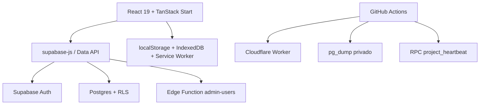
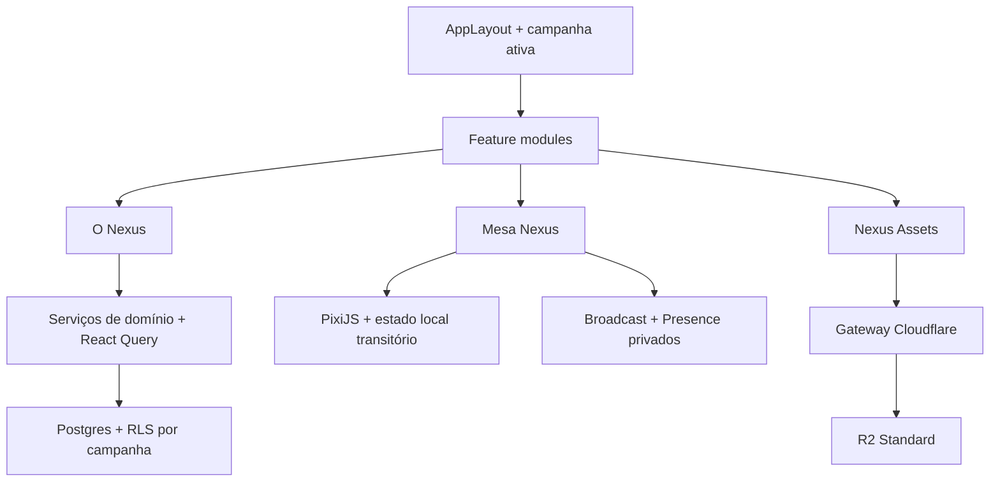

# Tadeon Nexus — Auditoria e mapa para a expansão

> Fase 0 do Plano Mestre de Expansão  
> Estado auditado: `main` no commit `84ef3ad21e5dcb7fccbfb87f1c6419ee8472f51d`  
> Data: 29 de julho de 2026

## 1. Resultado executivo

O Tadeon Nexus possui uma base funcional e segura o suficiente para receber a expansão, sem
necessidade de reconstrução. Autenticação, cargos, fichas, painel do mestre, monitoramento,
backup local, backup do Postgres, PWA e publicação no Cloudflare já formam uma fundação útil.

Entretanto, **O Nexus**, **Mesa Nexus** e **Nexus Assets não devem ser implementados diretamente
sobre o modelo atual**. Há três bloqueios arquiteturais:

1. os dados são globais e não existe uma entidade real de workspace, campanha ou participação;
2. cenas, NPCs, pistas, ameaças e outros registros do mestre ficam agregados em uma única linha
   JSONB de `game_settings`;
3. os arquivos de migration do repositório e o histórico registrado na produção não representam
   a mesma sequência.

O primeiro incremento de código após esta auditoria deve ser uma **Fundação de Campanhas e
Permissões**, protegida por feature flags e totalmente compatível com os dados existentes.

## 2. Escopo auditado

Foram inspecionados:

- estrutura de pastas e configuração de build;
- dependências e cadeia de suprimentos;
- rotas, estado e acesso a dados;
- autenticação e autorização;
- fichas, regras e painel do mestre;
- PWA, cache local, salvamento e diagnósticos;
- banco de produção, RLS, grants, funções e índices;
- Realtime e Supabase Storage;
- migrations locais e migrations registradas na produção;
- logs de API, Auth, Postgres, Edge Functions, Storage e Realtime;
- CI, heartbeat, backup independente e publicação Cloudflare;
- limites atuais dos planos gratuitos que afetam a arquitetura.

Esta fase não cria telas, tabelas, buckets ou canais novos.

## 3. Arquitetura atual



### 3.1 Frontend e execução

| Área               | Estado atual                                               | Consequência para a expansão                                   |
| ------------------ | ---------------------------------------------------------- | -------------------------------------------------------------- |
| Framework          | React 19, TanStack Router/Start, Vite 7                    | Adequado; novas rotas podem ser carregadas sob demanda         |
| Hospedagem         | Nitro para Cloudflare Worker                               | Adequado para SSR e gateway leve                               |
| Dados remotos      | Chamadas diretas ao Supabase dentro de rotas e componentes | Deve ganhar serviços/repositórios por domínio antes de crescer |
| Estado de servidor | TanStack Query instalado, pouco aproveitado                | Pode assumir cache, invalidação e paginação dos novos domínios |
| Estado local       | `useState`, props e objetos grandes                        | Inadequado para uma mesa gráfica de alta frequência            |
| UI                 | Tailwind 4 + Radix UI                                      | Reutilizável em painéis, modais, menus e sidebars              |
| Gráficos           | Recharts                                                   | Serve aos diagnósticos, não ao tabletop                        |
| Renderização 2D    | Inexistente                                                | PixiJS deve ser introduzido somente na fase da Mesa Nexus      |
| Markdown           | Inexistente                                                | Parser e sanitização devem entrar na fase de O Nexus           |
| Grafo              | Inexistente                                                | Implementar depois do núcleo de páginas e relações             |

### 3.2 Rotas existentes

| Rota               | Responsabilidade                               |
| ------------------ | ---------------------------------------------- |
| `/`                | arquivo de fichas e criação de personagem      |
| `/login`           | entrada, cadastro e solicitação de recuperação |
| `/reset-password`  | troca de senha por link                        |
| `/sheet/$id`       | ficha principal                                |
| `/sheet/$id/power` | Forma de Poder                                 |
| `/master-panel`    | painel global do mestre                        |
| `/manage-users`    | administração global de usuários e cargos      |
| `/nexus-tools`     | backup, restauração e diagnóstico              |
| `/offline`         | consulta local somente leitura                 |

Não há rotas de workspace, campanha, O Nexus, Mesa Nexus ou Nexus Assets.

### 3.3 Componentes e serviços reutilizáveis

| Componente/serviço      | Reutilização recomendada                                                            |
| ----------------------- | ----------------------------------------------------------------------------------- |
| `ProtectedShell`        | guarda de sessão; deve receber contexto da campanha ativa                           |
| `AppLayout`             | navegação principal e seletor futuro de workspace/campanha                          |
| `GlobalSearch`          | ponto inicial da busca unificada; trocar varredura de JSON por resultados paginados |
| `SessionWorkspace`      | painel operacional complementar à Mesa Nexus                                        |
| `MasterPanelNavigation` | navegação do mestre; receber entradas sob feature flag                              |
| `MasterCatalog`         | embrião de vínculo entre catálogo, fichas e futuros registros de O Nexus            |
| `SaveStatus`            | indicador reutilizável para operações persistentes                                  |
| `useSerializedAutosave` | útil para formulários; não usar para movimentos de token                            |
| `client-error-monitor`  | base de telemetria sanitizada                                                       |
| `nexus-backup`          | base do manifesto de exportação; hoje cobre apenas fichas e configurações           |
| `offline-cache`         | fallback local; deve ser separado por campanha e versão                             |
| componentes Radix       | painéis laterais, diálogos, menus contextuais e acessibilidade                      |

### 3.4 Pontos de acoplamento

Os seguintes arquivos já são grandes e concentram responsabilidades:

- `src/routes/sheet.$id.tsx`: aproximadamente 2.400 linhas;
- `src/routes/master-panel.tsx`: aproximadamente 1.950 linhas;
- `src/components/master/master-hub.tsx`: aproximadamente 1.890 linhas;
- `src/routes/sheet.$id_.power.tsx`: aproximadamente 1.300 linhas.

Não é necessário refatorá-los integralmente. Cada fase deve extrair apenas o domínio que tocar,
evitando uma reescrita paralela ao desenvolvimento.

## 4. Banco de dados atual

### 4.1 Tabelas públicas

| Tabela             | Linhas na auditoria | RLS | Uso atual                                       | Potencial de reaproveitamento                       |
| ------------------ | ------------------: | --- | ----------------------------------------------- | --------------------------------------------------- |
| `profiles`         |                   2 | Sim | identidade pública mínima                       | membros e autores                                   |
| `user_roles`       |                   2 | Sim | cargo global único por usuário                  | manter como compatibilidade/plataforma              |
| `character_sheets` |                   3 | Sim | fichas, inventário, armas, tramas e habilidades | associar a campanha sem mover dados inicialmente    |
| `game_settings`    |                   1 | Sim | singleton global do painel do mestre            | migrar gradualmente para configurações por campanha |
| `game_rules`       |                   1 | Sim | recorte público das regras                      | manter global e versionado                          |
| `app_error_logs`   |                   0 | Sim | diagnósticos sanitizados                        | ampliar com `workspace_id`/`campaign_id` opcionais  |

### 4.2 Estrutura global atual

`game_settings` usa `key = 'global'` e contém:

- título e fase da campanha como textos;
- cenas;
- NPCs;
- pistas;
- ameaças;
- interlúdios;
- Dobras;
- iniciativa;
- lembretes;
- fichas fixadas;
- regras e opções auxiliares.

Essas coleções ficam em JSONB dentro de uma única linha. Na auditoria, a linha ocupa cerca de
16,4 KB mesmo com as coleções narrativas ainda vazias. O formato é aceitável para o painel atual,
mas não oferece:

- autorização por campanha ou registro;
- paginação;
- backlinks e relações;
- atualização concorrente segura;
- Realtime granular;
- histórico por entidade;
- busca e indexação eficientes;
- carregamento parcial de uma cena.

### 4.3 Modelo de cargos

`user_roles.user_id` é único. Portanto, cada pessoa tem um único cargo global:

- `mestre`;
- `jogador`;
- `espectador`.

Esse modelo não representa uma pessoa que seja mestre em uma campanha e jogador em outra. A
expansão deve preservar `user_roles` durante a transição, mas mover a autorização cotidiana para
participações em workspace e campanha.

### 4.4 RLS e grants

O estado atual está coerente com a aplicação existente:

- perfis: o próprio usuário ou mestre;
- cargos: cada usuário lê somente o próprio cargo;
- fichas: proprietário ou mestre global;
- configurações: mestre global;
- regras públicas da aplicação: usuários autenticados;
- logs: inserção pelo próprio usuário e administração pelo mestre.

Todas as tabelas públicas possuem RLS. `anon` não possui grants sobre as tabelas. Funções
`SECURITY DEFINER` usadas por triggers não são executáveis por `anon` ou `authenticated`.

As tabelas novas da expansão precisarão de `GRANT` explícito além de RLS. O Supabase passou a
exigir opt-in explícito para novas tabelas na Data API; não se deve depender de privilégios
padrão.

### 4.5 Funções existentes

| Função                     | Segurança | Acesso externo       | Avaliação               |
| -------------------------- | --------- | -------------------- | ----------------------- |
| `get_public_game_settings` | invoker   | autenticados         | adequada                |
| `project_heartbeat`        | invoker   | anon/autenticados    | não lê nem altera dados |
| `handle_new_user`          | definer   | sem execução externa | trigger controlado      |
| `sync_profile_from_auth`   | definer   | sem execução externa | trigger controlado      |
| `sync_game_rules`          | definer   | sem execução externa | trigger controlado      |
| `set_updated_at`           | invoker   | sem execução externa | trigger controlado      |

### 4.6 Realtime

- Nenhuma tabela pública está em publicação Realtime.
- Não há política em `realtime.messages`.
- Não há canais privados autorizados por campanha.
- Não existe Presence de participantes.

Para a Mesa Nexus:

- alterações persistentes devem terminar em tabelas do Postgres;
- posição intermediária de arraste, cursor e seleção devem usar Broadcast;
- participantes online devem usar Presence com payload mínimo;
- canais devem ser privados e autorizados por participação real na campanha;
- o estado final do token deve ser persistido ao soltar ou em checkpoints, não a cada pixel.

### 4.7 Storage

Supabase Storage possui:

- zero buckets;
- zero objetos;
- nenhuma policy de aplicação em `storage.objects`.

Isso permite criar Nexus Assets sem migração de arquivos legados. O catálogo de arquivos deve
existir no Postgres e abstrair o provedor; o frontend não deve conhecer credenciais do R2.

### 4.8 Migrations: divergência crítica

O repositório contém 22 arquivos SQL em `supabase/migrations`. A produção registra apenas 7
migrations, com versões e nomes diferentes dos arquivos locais:

- `bootstrap_tadeon_nexus_schema`;
- `tighten_tadeon_data_api_grants`;
- `optimize_tadeon_rls_and_indexes`;
- `harden_auth_profile_sync`;
- `add_project_heartbeat`;
- `add_app_error_monitoring`;
- `index_error_log_resolver`.

Embora o schema de produção contenha os recursos esperados, executar `supabase db push` sobre o
diretório atual pode tentar reaplicar migrations antigas ou produzir um histórico incorreto.

**Bloqueio:** nenhuma migration da expansão deve ser aplicada antes de reconciliar o baseline.

## 5. Segurança e operação

### 5.1 Pontos aprovados

- frontend usa apenas publishable key;
- service role fica restrita à Edge Function;
- a Edge Function valida token e cargo novamente no servidor;
- RLS está ativa em todas as tabelas públicas;
- erros de cliente são sanitizados;
- não há bucket público;
- funções privilegiadas não são APIs públicas;
- API, Auth, Edge Function, Storage e Realtime não apresentaram erro operacional recente;
- Security Advisor não apontou tabela sem RLS ou função privilegiada pública.

### 5.2 Avisos remanescentes

1. **Leaked Password Protection Disabled:** configuração do Supabase Auth, sem correção por
   migration do aplicativo.
2. **Índice sem uso em `app_error_logs`:** informativo; a tabela está vazia e o índice atende
   consultas futuras do painel.
3. **Dependências transitivas de build:** `npm audit --omit=dev` encontrou 10 avisos
   (6 altos, 3 moderados e 1 baixo), sem vulnerabilidade crítica. Os avisos altos estão
   concentrados na cadeia Cloudflare/Nitro/Miniflare/Sharp e não possuem correção automática
   completa na versão atual. Esses pacotes são usados para build e preview, não para autorização
   de usuários ou RLS.
4. **Classificação de dependências:** Cloudflare Vite Plugin, Nitro e MCP de desenvolvimento estão
   em `dependencies`; devem ser revisados para `devDependencies` somente após confirmar que o
   artefato Nitro permanece autocontido.

Não executar `npm audit fix --force`: isso pode trocar versões principais e quebrar o adaptador
Lovable/Cloudflare.

### 5.3 Logs

Na amostra mais recente:

- API: 100 eventos, sem respostas 4xx/5xx;
- Edge Function: 14 eventos, todos 200;
- Auth: sem erro registrado;
- Storage: somente health checks, sem falha;
- Realtime: health checks, sem falha.

Os erros SQL recentes sobre `role_assignments` e ambiguidade de `role` foram consultas de
auditoria, não chamadas da aplicação. A tabela correta é `user_roles`.

## 6. Backup, offline e recuperação

### 6.1 O que já existe

- histórico Git para código;
- `pg_dump` semanal em artefato privado por 30 dias;
- checksum SHA-256 do dump;
- snapshots locais em IndexedDB, com limite de 10;
- exportação JSON manual;
- cache offline de fichas e painel;
- heartbeat diário do banco;
- CI completa em PR e em `main`.

### 6.2 Lacunas para a expansão

- o backup do Postgres não contém objetos do Supabase Storage ou R2;
- o JSON atual não exporta páginas, relações, assets ou cenas normalizadas;
- os snapshots locais não são separados por campanha;
- não existe teste automatizado de restauração do `pg_dump`;
- não existe inventário/checksum periódico dos objetos;
- o Service Worker não elimina versões antigas de cache durante `activate`;
- o backup futuro deve guardar manifestos, metadados e objetos de modo reconstruível.

Antes de Nexus Assets entrar em produção, adicionar backup de objetos e um restore drill
documentado.

## 7. Infraestrutura gratuita validada

### 7.1 Supabase

O projeto atual já usa:

- Auth;
- Postgres;
- Data API;
- Edge Function administrativa;
- logs;
- Realtime disponível, ainda não configurado;
- Storage disponível, ainda vazio.

Novas tabelas devem declarar `GRANT` explicitamente e manter RLS. Canais Realtime devem ser
privados.

### 7.2 Cloudflare

A arquitetura proposta permanece compatível com o plano gratuito:

- assets estáticos servidos pelo frontend;
- Worker apenas para SSR e gateway leve de arquivos;
- cálculos gráficos no navegador;
- R2 Standard para objetos grandes;
- nenhum processamento de luz, geometria ou grafo no Worker.

Os limites oficiais consultados em 29/07/2026 informam:

- R2 Standard: 10 GB-mês, 1 milhão de operações Classe A, 10 milhões de Classe B e egress
  gratuito dentro da franquia;
- Workers Free: 100 mil requisições por dia e 10 ms de CPU por invocação.

O limite interno recomendado continua sendo 8 GB. A aplicação também deve registrar contadores
de bytes, uploads e leituras, interrompendo novos uploads antes de ultrapassar o teto interno.

## 8. Arquitetura-alvo adaptada ao projeto real



### 8.1 Organização de código recomendada

```text
src/
  features/
    workspaces/
    campaigns/
    nexus/
      pages/
      relations/
      markdown/
      search/
    tabletop/
      canvas/
      scenes/
      entities/
      realtime/
    assets/
      catalog/
      upload/
      providers/
  services/
    supabase/
    diagnostics/
  workers/
    markdown/
    graph/
```

Rotas devem apenas compor os módulos. Consultas e mutations não devem continuar espalhadas por
componentes grandes.

### 8.2 Estado da Mesa Nexus

Separar três classes de estado:

1. **persistente:** cenas, camadas, entidades, paredes, luzes, permissões e handouts;
2. **transitório sincronizado:** cursor, seleção, arraste e presença;
3. **local de interface:** zoom, painel aberto, ferramenta ativa e preferências.

Essa separação impede gravações excessivas, conflitos e consumo desnecessário de Realtime.

### 8.3 Autorização

Modelo recomendado:

- `user_roles`: compatibilidade e administração da plataforma durante a migração;
- `workspace_members`: acesso ao workspace;
- `campaign_members`: cargo dentro da campanha;
- RLS sempre verifica participação no registro pai;
- mestre de uma campanha não recebe acesso automático a outra;
- arquivos, páginas privadas e entidades ocultas são filtrados no banco;
- canal Realtime usa o mesmo vínculo de `campaign_members`.

## 9. Tabelas necessárias por fase

Nenhuma das tabelas abaixo foi criada nesta auditoria.

### 9.1 Fundação

- `workspaces`;
- `workspace_members`;
- `campaigns`;
- `campaign_members`;
- `feature_flags`;
- `audit_events`;
- colunas opcionais de campanha nas tabelas legadas;
- índices de pertencimento e RLS.

### 9.2 Nexus Assets

- `assets`;
- `asset_uploads`;
- `asset_references`;
- `asset_usage_counters`;
- policies privadas por workspace/campanha.

O registro `assets` deve guardar UUID interno, provedor, chave do objeto, MIME, tamanho,
checksum, visibilidade e estado. Nenhuma URL permanente de objeto privado deve ser tratada como
identidade.

### 9.3 O Nexus

- `nexus_pages`;
- `nexus_page_aliases`;
- `nexus_relations`;
- `nexus_mentions`;
- `nexus_tags`;
- `nexus_page_tags`;
- `nexus_page_versions`;
- `nexus_attachments`.

Páginas devem usar UUID, slug apenas para navegação, conteúdo Markdown sanitizado, visibilidade e
campanha opcional. Relação semântica e menção textual são entidades distintas.

### 9.4 Mesa Nexus

- `tabletop_scenes`;
- `tabletop_layers`;
- `scene_entities`;
- `scene_tokens`;
- `scene_walls`;
- `scene_lights`;
- `scene_drawings`;
- `scene_handouts`;
- `session_rooms`;
- `session_participants`;
- policies de `realtime.messages`.

Transformações comuns ficam em `scene_entities`; propriedades específicas ficam nas tabelas
especializadas ou em JSONB pequeno e validado.

## 10. Dependências propostas

Adicionar somente na fase em que forem usadas e sempre atualizar o lockfile.

| Necessidade    | Direção                                                       | Momento                                             |
| -------------- | ------------------------------------------------------------- | --------------------------------------------------- |
| Canvas 2D      | `pixi.js` 8, preferindo WebGL em produção                     | primeiro MVP da Mesa                                |
| Markdown       | `unified`, `remark-parse`, `remark-frontmatter`, `remark-gfm` | núcleo de O Nexus                                   |
| Sanitização    | `remark-rehype`, `rehype-sanitize`, sem HTML arbitrário       | núcleo de O Nexus                                   |
| YAML           | parser YAML com schema seguro                                 | importação Markdown                                 |
| ZIP            | `fflate` ou equivalente pequeno                               | exportação portátil                                 |
| Grafo          | Graphology + Sigma, após medir o bundle                       | visualização em grafo                               |
| Listas grandes | virtualização leve                                            | quando páginas/assets ultrapassarem o limite medido |

Não adicionar agora:

- Yjs;
- CRDT;
- motor de física;
- IA paga;
- macros;
- rolagens;
- automação de combate;
- Durable Objects;
- editor rich text pesado.

## 11. Sequência de integração sem quebra

### Fase 1 — Baseline e fundação de campanhas

1. reconciliar migrations;
2. criar workspace e campanha padrão;
3. associar dados atuais sem remover campos;
4. criar memberships e RLS;
5. introduzir feature flags desligadas;
6. criar seletor de campanha somente após o backfill;
7. manter fallback para o singleton global.

### Fase 2 — Nexus Assets mínimo

1. catálogo de metadados;
2. provedor Supabase leve;
3. contrato de provider;
4. upload validado;
5. quota interna;
6. exportação e backup;
7. R2 somente após o contrato estar testado.

### Fase 3 — O Nexus mínimo

1. páginas Markdown;
2. aliases, tags e `[[wikilinks]]`;
3. menções e backlinks;
4. busca textual;
5. importação/exportação;
6. versões limitadas;
7. grafo somente depois da integridade das relações.

### Fase 4 — Mesa Nexus local

1. cena, camada e entidades persistentes;
2. canvas PixiJS;
3. pan, zoom, seleção e movimentação;
4. token ligado a ficha/NPC;
5. grade opcional;
6. sem Realtime inicialmente.

### Fase 5 — Mesa Nexus ao vivo

1. canais privados;
2. Presence;
3. Broadcast transitório;
4. persistência final de movimentos;
5. reconexão e resolução simples de conflito;
6. handouts e abertura de fichas/páginas.

### Fase 6 — visão e iluminação

1. paredes e portas;
2. visão por token;
3. iluminação;
4. névoa de guerra;
5. Web Worker para geometria pesada;
6. perfis de qualidade para dispositivos fracos.

## 12. Critérios da próxima fase

A Fase 1 só pode ser considerada concluída quando:

- migrations local e produção estiverem reconciliadas;
- dados existentes estiverem associados à campanha padrão;
- todos os usuários existentes mantiverem acesso;
- mestre, jogador, espectador e acesso negado tiverem testes;
- nenhuma tela nova aparecer sem flag;
- o rollback estiver documentado;
- backup do Postgres tiver sido executado antes da migration;
- lint, typecheck, testes e build estiverem verdes;
- Security e Performance Advisors forem reexecutados.

## 13. Entrega da Fase 0

### Arquivos criados

- `docs/NEXUS_EXPANSION_AUDIT.md`

### Arquivos de runtime alterados

- nenhum.

### Migrations aplicadas

- nenhuma.

### Tabelas, policies e buckets criados

- nenhum.

### Bibliotecas adicionadas

- nenhuma.

### Validação manual ainda necessária

- confirmar no GitHub Actions que o backup privado mais recente gerou artefato restaurável;
- confirmar que as variáveis de build do domínio definitivo incluem o URL público correto;
- decidir em fase futura quando o domínio canônico deixará de ser o Lovable;
- criar/configurar R2 somente na fase Nexus Assets, nunca antecipadamente.

## 14. Próxima fase objetiva

**Fase 1 — Reconciliar o baseline e criar a Fundação de Workspaces, Campanhas e Participações.**

Não iniciar O Nexus, Mesa Nexus ou Nexus Assets antes dessa fundação.

## 15. Referências oficiais consultadas

- [Supabase: tabelas não são expostas automaticamente às APIs de dados](https://supabase.com/changelog/45329-breaking-change-tables-not-exposed-to-data-and-graphql-api-automatically)
- [Supabase Realtime: primeiros passos](https://supabase.com/docs/guides/realtime/getting_started)
- [Supabase Realtime: autorização de canais privados](https://supabase.com/docs/guides/realtime/authorization)
- [Cloudflare R2: preços](https://developers.cloudflare.com/r2/pricing/)
- [Cloudflare R2: limites](https://developers.cloudflare.com/r2/platform/limits/)
- [Cloudflare Workers: preços](https://developers.cloudflare.com/workers/platform/pricing/)
